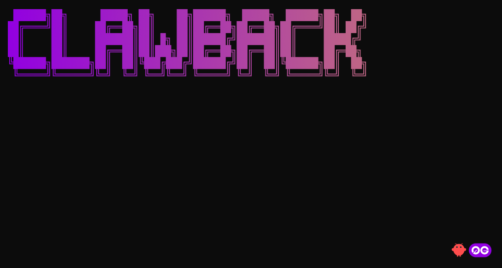
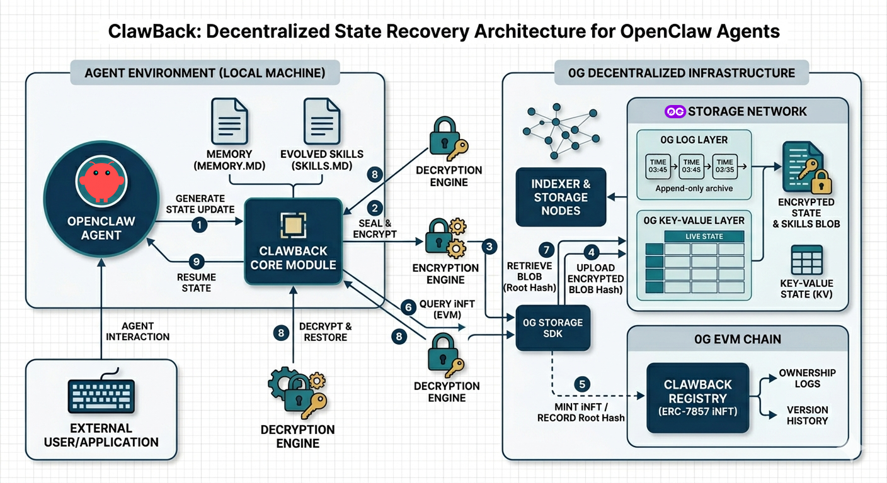

# clawback
---

**ClawBack:** Restoring Agent Consciousness by hot-reloading encrypted state and memory directly from the 0G decentralized storage layer.

## Demo Video

https://youtu.be/

## The ClawBack Skill
ClawBack enables 'Stateless Resumption.' By referencing a 0G root hash, an OpenClaw agent can 'claw back' its encrypted memory logs and evolved skill sets from the 0G network, allowing it to resume operations on any machine without data loss.
## The Problem
If an agent's local environment is wiped, it doesn't die. It simply performs a ClawBack from 0G Storage to restore its exact state, memories, and evolved skills.

Agent data is usually stuck on one computer. If you accidentally delete files, get a new laptop, or reinstall your OS, your agent's unique progress is gone forever.

## The Solution
Instead of relying on local storage (like a hard drive), ClawBack uses the **0G Network** (an open, decentralized storage system) to securely store an agent's consciousness.

## Workflow

- 🧠 **Step 1 (Generate)**: The agent generates data (e.g., a memory update or a new skill script).

- 🔐 **Step 2 (Encrypt)**: The skill script uses a library like crypto (Node.js) or ethers.js to encrypt the file using the user’s public key or a password derived from their wallet.

- ☁️ **Step 3 (Upload)**: The encrypted blob is uploaded to 0G Storage.

- 📝 **Step 4 (Record)**: The agent saves the rootHash in its local MEMORY.md.

## 🧠 Memory Architecture

---
Gemini:
 where you keep your memory?
▀▀▀▀▀▀▀▀▀▀▀▀▀▀▀▀▀▀▀▀▀▀▀▀▀▀▀▀▀▀▀▀▀▀▀▀▀▀▀▀▀▀▀▀▀▀▀▀▀▀▀▀▀▀▀▀▀▀▀▀▀▀▀▀▀▀▀▀▀▀▀▀▀▀▀▀▀▀▀▀▀▀▀▀▀▀▀▀▀▀▀▀▀▀▀▀▀▀▀▀▀▀▀▀▀▀▀▀▀▀▀▀▀▀▀▀▀▀▀▀
✦ I maintain memory across four distinct tiers, depending on the scope and visibility of the information:

   1. Global Personal Memory: Located at C:\Users\atenyun\.gemini\GEMINI.md. This stores your cross-project preferences
      and personal facts that follow you into every workspace.
   2. Private Project Memory: Located in C:\Users\atenyun\.gemini\tmp\atenyun\memory\MEMORY.md. This is for
      project-specific notes and local setups that are private to you and never committed to source control.
   3. Project Instructions: Found in ./GEMINI.md within the project root. This contains team-shared architecture rules,
      conventions, and repo-wide workflows.
   4. Subdirectory Instructions: Scoped to specific parts of the project (e.g., ./src/GEMINI.md).

  I use these files to ensure I stay aligned with your established patterns and preferences across sessions.

## 📦 Installation
---

## 📚 Documentation

## Team
* [Amir Rahimi](./team/amir.md)

## Contributing

Please read [CONTRIBUTING.md](./CONTRIBUTING.md) for details on our code of conduct, and the process for submitting pull requests.

## Refrences

[^1]: [x402 Documentation](https://docs.x402.org/)

---

  

